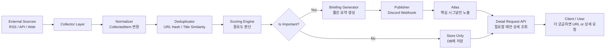

# Perix Sentinel Scoring & Briefing PRD

> **구현 주의:** 이 모듈은 Collector가 수집한 `CollectedItem`을 기반으로 중요도를 계산하고, 일정 기준 이상인 항목만 브리핑으로 발행한다. 중요하지 않은 항목도 버리지 않고 SQLite에 저장하여 이후 히스토리/상세 조회/트렌드 분석에 활용한다.

---

## 1. 목적

Perix Sentinel은 여러 외부 소스에서 수집한 AI 관련 데이터를 단순 저장하는 것이 아니라,  
사용자에게 의미 있는 핵심 신호만 선별하여 브리핑으로 제공하는 것을 목표로 한다.

현재 수집 대상은 다음과 같다.

- OpenAI
- Anthropic
- Google DeepMind
- Meta AI
- Mistral AI
- HuggingFace Trending Models
- GitHub Trending

이 모듈의 핵심 목적은 다음과 같다.

```text
CollectedItem
→ Score 계산
→ 중요도 판단
→ 중요 항목은 Briefing 생성
→ 나머지는 Store Only
```

---

## 2. 처리 대상

Collector Layer에서 수집 및 정규화된 `CollectedItem`을 대상으로 한다.

**입력 데이터 예시**

```json
{
  "source": "GitHub Trending",
  "title": "microsoft/typescript",
  "url": "https://github.com/microsoft/typescript",
  "published_at": "2026-05-15T00:00:00",
  "summary": "TypeScript is a strongly typed programming language...",
  "tags": ["github", "typescript", "open-source"],
  "metadata": {
    "language": "TypeScript",
    "stars": 120000,
    "stars_today": 2500,
    "forks": 15000
  }
}
```

---

## 3. 핵심 기능

## 3.1 Scoring Engine

수집된 항목의 중요도를 계산한다.

| 점수 요소 | 설명 |
|---|---|
| Source Weight | 출처 자체의 중요도 |
| Keyword Weight | 제목/요약/태그에 포함된 핵심 키워드 |
| Popularity Weight | likes, downloads, stars_today 등 인기 지표 |
| Recency Weight | 최신성 |
| Category Weight | 모델 출시, 에이전트, reasoning 등 전략 카테고리 |

---

## 3.2 Importance Decision

Scoring Engine이 계산한 점수를 기준으로 브리핑 발행 여부를 결정한다.

| 조건 | 처리 |
|---|---|
| score >= threshold | Briefing Generator로 전달 |
| score < threshold | Store Only |

초기 기준값:

```text
BRIEFING_THRESHOLD = 15
```

---

## 3.3 Briefing Generator

중요도가 높은 항목에 대해 짧은 요약 브리핑을 생성한다.

**브리핑 생성 목적**

- 사용자가 모든 데이터를 직접 확인하지 않아도 됨
- 중요한 AI 신호만 빠르게 파악 가능
- Discord Webhook / Telegram Bot / 웹 대시보드로 발행 가능

**브리핑 예시**

```text
[Perix Sentinel Briefing]

Meta AI 관련 GitHub 레포지토리가 급상승했습니다.

- Source: GitHub Trending
- Title: awesome-llama-agents
- Reason: llama, agent 키워드 포함 / stars_today 높음
- URL: https://github.com/...
```

---

## 3.4 Store Only

중요도 기준에 미달하는 항목은 브리핑하지 않고 DB에만 저장한다.

**저장 목적**

- 이후 상세 조회
- 히스토리 분석
- 트렌드 변화 추적
- 브리핑 누락 검토

---

## 4. Score 계산 정책

## 4.1 Source Weight

출처별 기본 가중치를 부여한다.

```python
SOURCE_WEIGHTS = {
    "OpenAI": 10,
    "Anthropic": 9,
    "DeepMind": 9,
    "Meta AI": 8,
    "Mistral AI": 8,
    "HuggingFace": 7,
    "GitHub Trending": 7
}
```

---

## 4.2 Keyword Weight

AI 트렌드와 직접적으로 관련 있는 키워드에 가중치를 부여한다.

```python
KEYWORD_WEIGHTS = {
    "agent": 5,
    "mcp": 5,
    "reasoning": 5,
    "multimodal": 4,
    "llama": 4,
    "claude": 4,
    "gpt": 4,
    "gemini": 4,
    "mixtral": 4,
    "moe": 4,
    "rag": 4,
    "memory": 3,
    "inference": 3,
    "fine-tuning": 3,
    "open-weight": 3,
    "safety": 3
}
```

---

## 4.3 Popularity Weight

HuggingFace와 GitHub처럼 popularity signal이 있는 소스에 적용한다.

### HuggingFace

```python
popularity_score =
    min(likes / 100, 5) +
    min(downloads / 10000, 5)
```

### GitHub Trending

```python
popularity_score =
    min(stars_today / 100, 10) +
    min(stars / 10000, 5)
```

---

## 4.4 Recency Weight

최신 데이터일수록 높은 점수를 부여한다.

```python
if age_days <= 1:
    recency_score = 5
elif age_days <= 3:
    recency_score = 3
elif age_days <= 7:
    recency_score = 1
else:
    recency_score = 0
```

---

## 4.5 최종 Score

초기 MVP에서는 단순 합산 방식으로 구현한다.

```python
final_score =
    source_score +
    keyword_score +
    popularity_score +
    recency_score
```

---

## 5. 데이터 저장 구조

기존 `CollectedItem` 저장 구조에 score 관련 필드를 추가한다.

```json
{
  "source": "HuggingFace",
  "title": "meta-llama/Llama-4",
  "url": "https://huggingface.co/meta-llama/Llama-4",
  "published_at": "2026-05-15T00:00:00",
  "summary": "Trending HuggingFace model",
  "tags": ["huggingface", "llama", "text-generation"],
  "score": 18,
  "importance": "high",
  "metadata": {
    "likes": 1200,
    "downloads": 50000,
    "pipeline_tag": "text-generation"
  }
}
```

---

## 6. DB 스키마 변경

기존 SQLite 저장 구조에 아래 필드를 추가한다.

```sql
ALTER TABLE collected_items ADD COLUMN score INTEGER DEFAULT 0;
ALTER TABLE collected_items ADD COLUMN importance TEXT DEFAULT 'normal';
ALTER TABLE collected_items ADD COLUMN is_briefed BOOLEAN DEFAULT FALSE;
ALTER TABLE collected_items ADD COLUMN briefed_at DATETIME;
```

---

## 7. 아키텍처 흐름



---

## 8. 추천 구현 구조

```text
perix-sentinel/
└── app/
    ├── scoring/
    │   ├── engine.py
    │   ├── policies.py
    │   └── schemas.py
    │
    ├── briefing/
    │   ├── generator.py
    │   ├── templates.py
    │   └── publisher.py
    │
    ├── repositories/
    │   └── collected_item_repository.py
    │
    └── services/
        └── signal_pipeline.py
```

---

## 9. 모듈별 책임

## 9.1 `scoring/engine.py`

`CollectedItem`을 입력받아 최종 score를 계산한다.

```python
def calculate_score(item: CollectedItem) -> int:
    source_score = calculate_source_score(item)
    keyword_score = calculate_keyword_score(item)
    popularity_score = calculate_popularity_score(item)
    recency_score = calculate_recency_score(item)

    return source_score + keyword_score + popularity_score + recency_score
```

---

## 9.2 `scoring/policies.py`

가중치 정책을 관리한다.

```python
SOURCE_WEIGHTS = {...}
KEYWORD_WEIGHTS = {...}
BRIEFING_THRESHOLD = 15
```

---

## 9.3 `briefing/generator.py`

중요 항목을 사용자에게 전달하기 쉬운 형태로 요약한다.

```python
def generate_briefing(item: CollectedItem) -> str:
    return f"""
[Perix Sentinel]

{item.title}

Source: {item.source}
Score: {item.score}
Reason: {item.reason}
URL: {item.url}
"""
```

---

## 9.4 `briefing/publisher.py`

생성된 브리핑을 외부 채널로 발행한다.

초기 대상:

```text
Discord Webhook
```

향후 대상:

```text
Telegram Bot
Email
Web Dashboard
```

---

## 10. 중요도 등급

score에 따라 importance 등급을 부여한다.

| Score | Importance | 처리 |
|---|---|---|
| 0 ~ 9 | low | Store Only |
| 10 ~ 14 | normal | Store Only |
| 15 ~ 24 | high | Briefing |
| 25+ | critical | 즉시 Briefing |

---

## 11. 브리핑 발행 조건

초기 정책:

```python
if item.score >= BRIEFING_THRESHOLD:
    publish_briefing(item)
else:
    store_only(item)
```

중복 브리핑 방지를 위해 `is_briefed` 값을 확인한다.

```python
if item.is_briefed:
    skip_publish()
```

---

## 12. 상세 조회 API

브리핑에서는 핵심 정보만 노출하고, 사용자가 더 궁금할 때 상세 조회할 수 있도록 한다.

## API 예시

```text
GET /items/{item_id}
```

## 응답 예시

```json
{
  "id": "uuid",
  "source": "GitHub Trending",
  "title": "awesome-mcp",
  "url": "https://github.com/...",
  "summary": "A collection of MCP servers and tools",
  "tags": ["github", "mcp", "agent"],
  "score": 22,
  "importance": "high",
  "metadata": {
    "stars": 10000,
    "stars_today": 1200,
    "language": "Python"
  }
}
```

---

## 13. 향후 확장 예정

### v0.2

- score reason 저장
- keyword match 결과 저장
- source별 threshold 분리
- Daily Briefing 생성

---

### v0.3

- 동일 키워드 기반 signal clustering
- OpenAI 발표와 GitHub/HF 반응 연결
- 태그 그래프 생성

---

### v0.4

- LLM 기반 중요도 평가
- 사용자 관심사 기반 personalized briefing
- 주간 AI Trend Report 생성

---

## 14. MVP 완료 기준

다음 조건을 만족하면 MVP 완료로 본다.

- `CollectedItem`에 score 계산 가능
- Source Weight 적용 가능
- Keyword Weight 적용 가능
- HuggingFace/GitHub popularity signal 반영 가능
- score 기준으로 Store Only / Briefing 분기 가능
- Discord Webhook으로 중요 항목 발행 가능
- 중복 브리핑 방지 가능
- 상세 조회 API로 저장된 항목 조회 가능

---

## 15. 핵심 포인트

이 모듈은 Perix Sentinel이 단순 수집기를 넘어서는 핵심 지점이다.

```text
수집된 데이터
→ 중요한 신호
→ 사용자에게 전달할 브리핑
```

으로 변환하는 역할을 한다.

즉, Scoring & Briefing Layer는 Perix Sentinel의 첫 번째 Intelligence Layer이다.