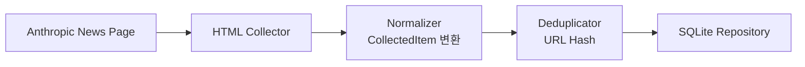

# Anthropic Collector PRD

> **구현 주의:** Anthropic 공식 사이트는 RSS 피드를 제공하지 않아 HTML 스크래핑 방식으로 구현되었다. 자세한 경위는 [구현 회고](<../../notes/Anthropic Collector 구현 회고.md>)를 참조.

## 1. 데이터 수집

Anthropic 공식 뉴스 페이지에서 데이터를 수집한다.

| 항목 | 값 |
|---|---|
| 수집 URL | `https://www.anthropic.com/news` |
| 수집 방식 | HTML 스크래핑 (BeautifulSoup) |

**수집 대상 필드**

- `title`
- `link`
- `published date`
- `summary` (description)
- `guid`

---

## 2. 데이터 정규화

수집한 데이터를 Perix Sentinel 공통 모델(`CollectedItem`)로 변환한다.

**공통 포맷**

```json
{
  "source": "Anthropic",
  "title": "Claude 4 released",
  "url": "https://...",
  "published_at": "2026-05-15T00:00:00",
  "summary": "Anthropic announced...",
  "tags": ["anthropic"]
}
```

---

## 3. 중복 제거

이미 수집된 데이터인지 확인한다.

| 정책 | 방식 |
|---|---|
| 초기 정책 | URL Hash 기반 중복 제거 |

---

## 4. 저장

정규화된 데이터를 SQLite에 저장한다.

**저장 목적**

- 중복 방지
- 이후 상세 조회
- 브리핑 히스토리 관리

---

## 아키텍처 흐름



---

## 구현 노트

- 구현 회고: [Anthropic Collector 구현 회고](<../../notes/Anthropic Collector 구현 회고.md>) — Anthropic이 공식 RSS를 제공하지 않아 HTML 스크래핑으로 전환한 경위와 검증 결과
