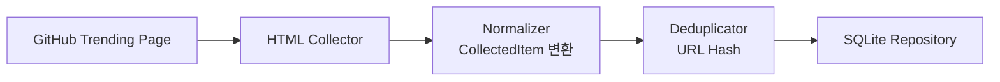

# GitHub Trending Collector PRD

> **구현 주의:** GitHub Trending은 공식 Trending API를 안정적으로 제공하지 않아 HTML 스크래핑 방식으로 구현한다.

## 1. 데이터 수집

GitHub Trending 페이지에서 데이터를 수집한다.

| 항목 | 값 |
|---|---|
| 수집 URL | `https://github.com/trending` |
| 수집 방식 | HTML 스크래핑 (BeautifulSoup) |

---

## 2. 수집 대상

Trending 중인 GitHub Repository 데이터를 수집한다.

**수집 대상 필드**

- `repository name`
- `owner`
- `repository url`
- `description`
- `language`
- `stars`
- `stars today`
- `forks`

---

## 3. 데이터 정규화

수집한 데이터를 Perix Sentinel 공통 모델(`CollectedItem`)로 변환한다.

**공통 포맷**

```json
{
  "source": "GitHub Trending",
  "title": "microsoft/typescript",
  "url": "https://github.com/microsoft/typescript",
  "published_at": "2026-05-15T00:00:00",
  "summary": "TypeScript is a strongly typed programming language...",
  "tags": [
    "github",
    "typescript",
    "open-source"
  ],
  "metadata": {
    "language": "TypeScript",
    "stars": 120000,
    "stars_today": 2500,
    "forks": 15000
  }
}
```

---

## 4. 중복 제거

이미 수집된 데이터인지 확인한다.

| 정책 | 방식 |
|---|---|
| 초기 정책 | URL Hash 기반 중복 제거 |

---

## 5. 저장

정규화된 데이터를 SQLite에 저장한다.

**저장 목적**

- 트렌딩 레포지토리 히스토리 추적
- 개발 생태계 흐름 분석
- 기술 트렌드 변화 감지
- 브리핑 데이터 활용

---

## 아키텍처 흐름



---

## 구현 노트

### GitHub Trending 특성

GitHub Trending은 단순 저장소 목록이 아니라:

```text
현재 개발자들이 실제로 관심을 가지기 시작한 기술 흐름
```

을 반영한다.

따라서:
- stars today
- language
- description
- repository topic

등 popularity signal을 적극 활용한다.

---

### 추천 수집 URL

#### 전체 Trending

```text
https://github.com/trending
```

---

#### 언어별 Trending (향후 확장)

```text
https://github.com/trending/python
https://github.com/trending/typescript
https://github.com/trending/rust
```

---

### HTML 구조 변경 가능성

GitHub Trending 페이지는 구조 변경 가능성이 있으므로:

- CSS class 의존 최소화
- repository href 기반 파싱 우선
- selector 실패 시 warning 로그 출력

전략으로 구현한다.

---

### 태그 자동화 추천

repository name 및 description 기반으로 자동 태그를 생성한다.

예시:

```python
if "agent" in description.lower():
    tags.append("agent")

if "rag" in description.lower():
    tags.append("rag")

if language:
    tags.append(language.lower())
```

---

## 추천 구현 구조

```text
collectors/
└── github/
    ├── collector.py
    ├── parser.py
    ├── normalizer.py
    └── repository.py
```

---

## 향후 확장 예정

### 추가 예정 기능

- 언어별 Trending 분석
- GitHub API 상세 메타데이터 연동
- Star 증가율 분석
- AI 관련 repository 분류
- OpenAI/HF 데이터와 연관 분석

---

## 예상 주요 태그

```text
agent
rag
mcp
workflow
memory
browser-use
llm
multimodal
ai
automation
```

---

## Popularity Score 전략 (예정)

향후 repository 중요도 계산을 추가한다.

예시:

```python
score =
    stars_today * 0.5 +
    stars * 0.3 +
    recency * 0.2
```

---

## Collector 목적

GitHub Trending Collector는 단순 저장소 수집이 아니라:

```text
"개발자들이 실제로 만들기 시작한 기술과 AI 생태계 흐름을 추적"
```

하는 것을 목표로 한다.