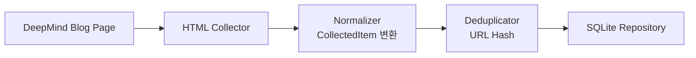

# DeepMind Collector PRD

> **구현 주의:** Google DeepMind는 안정적인 공식 RSS 피드를 제공하지 않아 HTML 스크래핑 방식으로 구현한다.

## 1. 데이터 수집

Google DeepMind 공식 블로그 페이지에서 데이터를 수집한다.

| 항목 | 값 |
|---|---|
| 수집 URL | `https://deepmind.google/blog/` |
| 수집 방식 | HTML 스크래핑 (BeautifulSoup) |

**수집 대상 필드**

- `title`
- `link`
- `published date`
- `category`
- `summary` (가능한 경우)
- `guid`

---

## 2. 데이터 정규화

수집한 데이터를 Perix Sentinel 공통 모델(`CollectedItem`)로 변환한다.

**공통 포맷**

```json
{
  "source": "DeepMind",
  "title": "Gemma 4 released",
  "url": "https://...",
  "published_at": "2026-05-15T00:00:00",
  "summary": "Google DeepMind announced...",
  "tags": ["deepmind", "google"]
}
```

---

## 3. 중복 제거

이미 수집된 데이터인지 확인한다.

| 정책 | 방식 |
|---|---|
| 초기 정책 | URL Hash 기반 중복 제거 |

---

## 4. 저장

정규화된 데이터를 SQLite에 저장한다.

**저장 목적**

- 중복 방지
- 이후 상세 조회
- 브리핑 히스토리 관리

---

# 아키텍처 흐름



---

# 구현 노트

## DeepMind 링크 구조 주의

DeepMind 블로그는 일부 게시글이 아래 도메인으로 연결될 수 있다.

```text
https://blog.google/
```

따라서:

- `deepmind.google`
- `blog.google`

모두 허용해야 한다.

---

## HTML 구조 변경 가능성

Google DeepMind는 UI 변경 가능성이 존재하므로:

- CSS class 의존 최소화
- article href 패턴 기반 파싱 우선
- selector 실패 시 로그 출력

전략으로 구현한다.

---

## 추천 구현 구조

```text
collectors/
└── deepmind/
    ├── collector.py
    ├── parser.py
    ├── normalizer.py
    └── repository.py
```

---

## 향후 확장 예정

### 추가 예정 기능

- category 기반 태그 분류
- AI 요약 생성
- 중요도(score) 계산
- 관련 논문/arXiv 연결
- Gemini/Gemma 키워드 추적

---

## 예상 주요 카테고리

```text
Research
Science
Gemini
Gemma
Robotics
Safety
Multimodal
Reasoning
```

---

## Collector 목적

DeepMind Collector는 단순 뉴스 수집이 아니라:

```text
"Google DeepMind의 연구 방향성과 AI 기술 흐름을 추적"
```

하는 것을 목표로 한다.