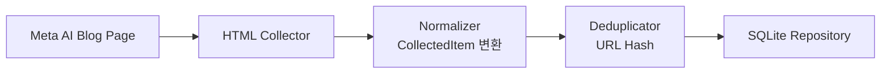

# Meta AI Collector PRD

> **구현 주의:** Meta AI Blog는 안정적인 공식 RSS 피드를 제공하지 않아 HTML 스크래핑 방식으로 구현한다.

## 1. 데이터 수집

Meta AI 공식 블로그 페이지에서 데이터를 수집한다.

| 항목 | 값 |
|---|---|
| 수집 URL | `https://ai.meta.com/blog/` |
| 수집 방식 | HTML 스크래핑 (BeautifulSoup) |

**수집 대상 필드**

- `title`
- `link`
- `published date`
- `summary` (description)
- `category`
- `guid`

---

## 2. 데이터 정규화

수집한 데이터를 Perix Sentinel 공통 모델(`CollectedItem`)로 변환한다.

**공통 포맷**

```json
{
  "source": "Meta AI",
  "title": "Introducing Llama 4",
  "url": "https://...",
  "published_at": "2026-05-15T00:00:00",
  "summary": "Meta introduced...",
  "tags": ["meta", "llama"]
}
```

---

## 3. 중복 제거

이미 수집된 데이터인지 확인한다.

| 정책 | 방식 |
|---|---|
| 초기 정책 | URL Hash 기반 중복 제거 |

---

## 4. 저장

정규화된 데이터를 SQLite에 저장한다.

**저장 목적**

- 중복 방지
- 이후 상세 조회
- 브리핑 히스토리 관리

---

## 아키텍처 흐름



---

## 구현 노트

### Meta AI Blog 특성

Meta AI Blog는 아래와 같은 AI 관련 게시글을 주로 다룬다.

```text
Llama
Multimodal
Generative AI
Robotics
Audio
Computer Vision
Research
Safety
```

---

### HTML 구조 변경 가능성

Meta는 프론트엔드 구조가 변경될 가능성이 있으므로:

- CSS class 의존 최소화
- article href 기반 파싱 우선
- selector 실패 시 warning 로그 출력

전략으로 구현한다.

---

### 태그 자동화 추천

제목 및 summary 기반으로 자동 태그를 생성한다.

예시:

```python
if "llama" in title.lower():
    tags.append("llama")

if "multimodal" in summary.lower():
    tags.append("multimodal")
```

---

## 추천 구현 구조

```text
collectors/
└── meta/
    ├── collector.py
    ├── parser.py
    ├── normalizer.py
    └── repository.py
```

---

## 향후 확장 예정

### 추가 예정 기능

- AI 요약 생성
- 중요도(score) 계산
- HuggingFace 모델 연결
- GitHub Trending 연관 분석
- Llama 관련 키워드 추적

---

## 예상 주요 태그

```text
llama
multimodal
reasoning
vision
audio
robotics
safety
open-source
```

---

## Collector 목적

Meta AI Collector는 단순 뉴스 수집이 아니라:

```text
"Meta의 오픈소스 AI 생태계와 연구 방향성을 추적"
```

하는 것을 목표로 한다.