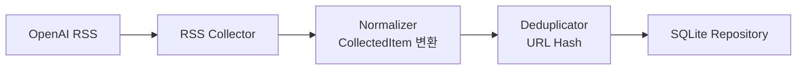

1. RSS 데이터 수집

OpenAI 공식 RSS Feed를 수집한다.

RSS URL:

https://openai.com/news/rss.xml

수집 대상:

title
link
published date
summary(description)
2. 데이터 정규화

수집한 RSS 데이터를 Perix Sentinel 공통 모델(CollectedItem)로 변환한다.

공통 포맷:

{
  "source": "OpenAI",
  "title": "GPT-6 released",
  "url": "https://...",
  "published_at": "2026-05-15T00:00:00",
  "summary": "OpenAI announced...",
  "tags": ["openai"]
}
3. 중복 제거

이미 수집된 데이터인지 확인한다.

초기 정책:

URL Hash 기반 중복 제거
4. 저장

정규화된 데이터를 SQLite에 저장한다.

저장 목적:

중복 방지
이후 상세 조회
브리핑 히스토리 관리
아키텍처 흐름
