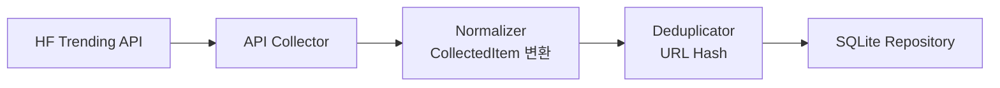

# HuggingFace Trending Models Collector PRD

> **구현 주의:** HuggingFace는 HTML 스크래핑 대신 공식 API 기반으로 구현한다.

## 1. 데이터 수집

HuggingFace Trending Models API에서 데이터를 수집한다.

| 항목 | 값 |
|---|---|
| 수집 URL | `https://huggingface.co/api/trending?type=model` |
| 수집 방식 | HTTP API 요청 (`requests`) |
| 인증 | 초기 MVP에서는 API Key 없이 구현 |

---

## 2. 수집 대상

Trending 중인 HuggingFace 모델 데이터를 수집한다.

**수집 대상 필드**

- `model name`
- `author`
- `likes`
- `downloads`
- `pipeline_tag`
- `tags`
- `updated_at`
- `url`

---

## 3. 데이터 정규화

수집한 데이터를 Perix Sentinel 공통 모델(`CollectedItem`)로 변환한다.

**공통 포맷**

```json
{
  "source": "HuggingFace",
  "title": "meta-llama/Llama-4",
  "url": "https://huggingface.co/meta-llama/Llama-4",
  "published_at": "2026-05-15T00:00:00",
  "summary": "Trending HuggingFace model",
  "tags": [
    "huggingface",
    "llama",
    "text-generation"
  ],
  "metadata": {
    "likes": 1200,
    "downloads": 50000,
    "pipeline_tag": "text-generation"
  }
}
```

---

## 4. 중복 제거

이미 수집된 데이터인지 확인한다.

| 정책 | 방식 |
|---|---|
| 초기 정책 | URL Hash 기반 중복 제거 |

---

## 5. 저장

정규화된 데이터를 SQLite에 저장한다.

**저장 목적**

- 트렌딩 모델 히스토리 추적
- 모델 인기 변화 분석
- AI 생태계 흐름 분석
- 브리핑 데이터 활용

---

## 아키텍처 흐름



---

## 구현 노트

### HuggingFace 특성

HuggingFace는 단순 뉴스 사이트가 아니라:

```text
AI 모델 플랫폼
```

이다.

따라서:
- likes
- downloads
- tags
- pipeline_tag

같은 popularity signal을 적극 활용한다.

---

### 추천 API 요청 예시

```python
import requests

url = "https://huggingface.co/api/trending?type=model"

response = requests.get(url)

data = response.json()
```

---

### 초기 인증 전략

초기 MVP는 인증 없이 구현한다.

향후 rate limit 대응을 위해:

```text
HF_TOKEN
```

환경변수 추가 가능하도록 설계한다.

---

### 태그 자동화 추천

모델명 및 metadata 기반으로 자동 태그를 생성한다.

예시:

```python
if "llama" in model_name.lower():
    tags.append("llama")

if pipeline_tag == "text-generation":
    tags.append("llm")
```

---

## 추천 구현 구조

```text
collectors/
└── huggingface/
    ├── collector.py
    ├── parser.py
    ├── normalizer.py
    └── repository.py
```

---

## 향후 확장 예정

### 추가 예정 기능

- Trending Dataset Collector
- Trending Spaces Collector
- Popularity Score 계산
- GitHub Trending 연관 분석
- Ollama 모델 연동 분석
- GGUF 키워드 추적

---

## 예상 주요 태그

```text
llama
mixtral
gguf
multimodal
reasoning
vision
audio
text-generation
embedding
```

---

## Popularity Score 전략 (예정)

향후 모델 중요도 계산을 추가한다.

예시:

```python
score =
    likes * 0.4 +
    downloads * 0.4 +
    recency * 0.2
```

---

## Collector 목적

HuggingFace Collector는 단순 모델 수집이 아니라:

```text
"AI 생태계에서 실제로 사용되기 시작한 모델과 기술 흐름을 추적"
```

하는 것을 목표로 한다.