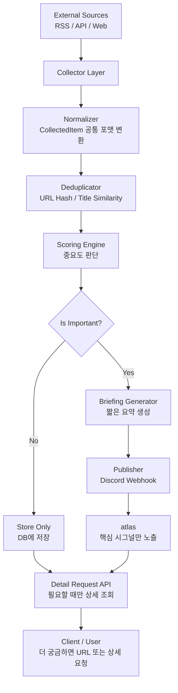

# Perix Sentinel — Architecture

```mermaid
flowchart TD
    A[External Sources<br/>RSS / API / Web] --> B[Collector Layer]

    B --> C[Normalizer<br/>CollectedItem 공통 포맷 변환]

    C --> D[Deduplicator<br/>URL Hash / Title Similarity]

    D --> E[Scoring Engine<br/>중요도 판단]

    E --> F{Is Important?}

    F -- No --> G[Store Only<br/>DB에 저장]
    F -- Yes --> H[Briefing Generator<br/>짧은 요약 생성]

    H --> I[Publisher<br/>Discord Webhook]

    I --> J[atlas<br/>핵심 시그널만 노출]

    G --> K[Detail Request API<br/>필요할 때만 상세 조회]
    J --> K

    K --> L[Client / User<br/>더 궁금하면 URL 또는 상세 요청]
```
